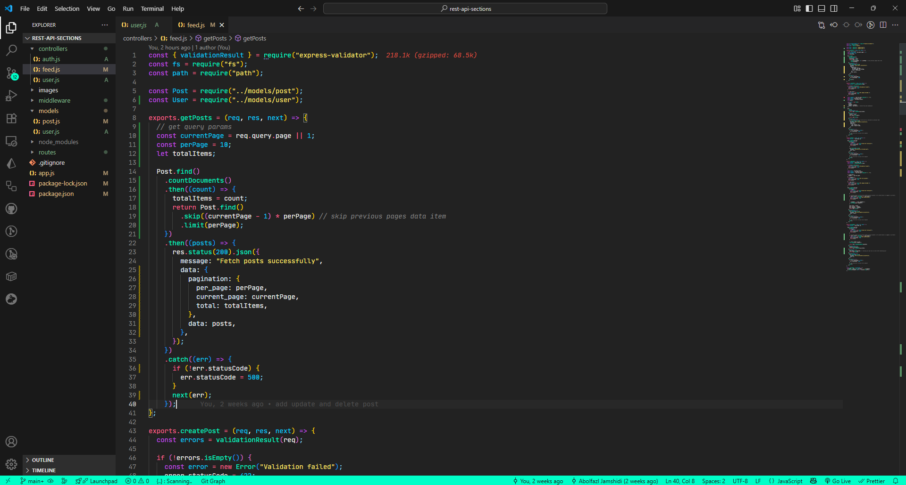
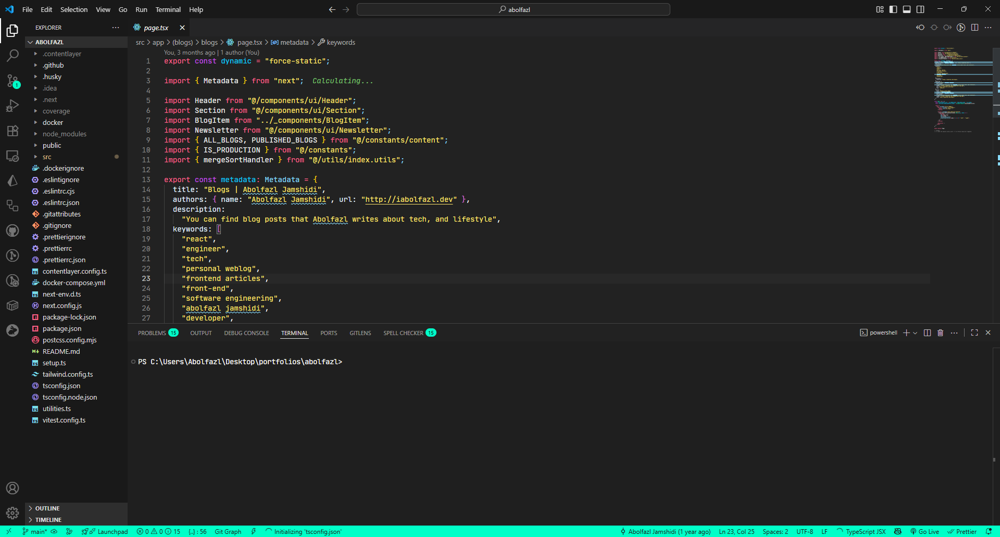
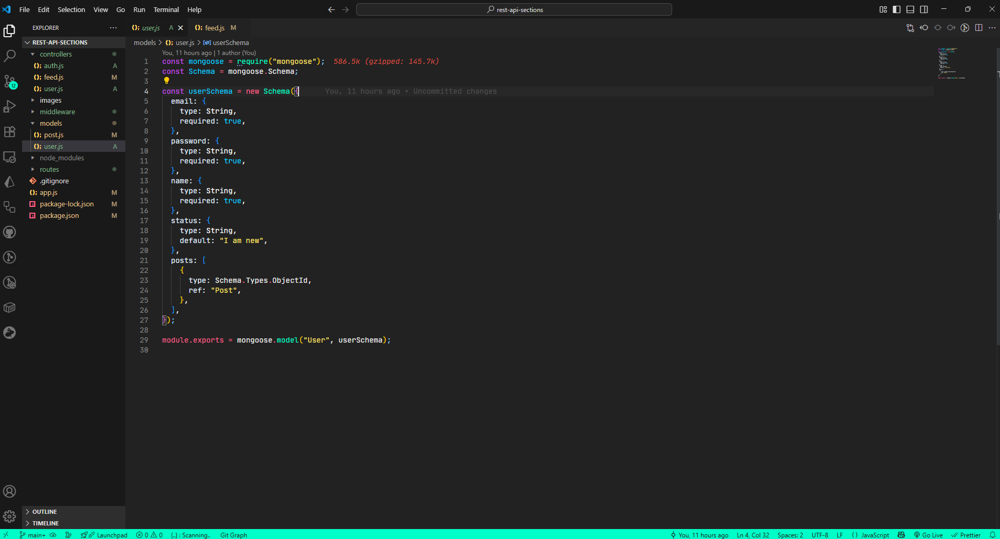

# AstroBloom Theme for VSCode

AstroBloom is a **modern, dark theme for Visual Studio Code** designed for comfort and readability with soft contrast and vibrant highlights.

## Features

- Dark background with soft pastel highlights
- Easy-on-the-eyes color palette
- Supports JavaScript, TypeScript, HTML, CSS, and more
- Syntax highlighting for CommonJS `module.exports`
- Styled activity bar, status bar, tabs, minimap, terminal, and editor gutters

## Screenshots

## Installation

1. Open VSCode
2. Go to Extensions (`Ctrl+Shift+X` / `Cmd+Shift+X`)
3. Search for `AstroBloom`
4. Click **Install**
5. Go to settings → Color Theme → Select **AstroBloom**

## Contributing

Contributions and feedback are welcome! Feel free to open an issue or pull request.

## License

MIT License
